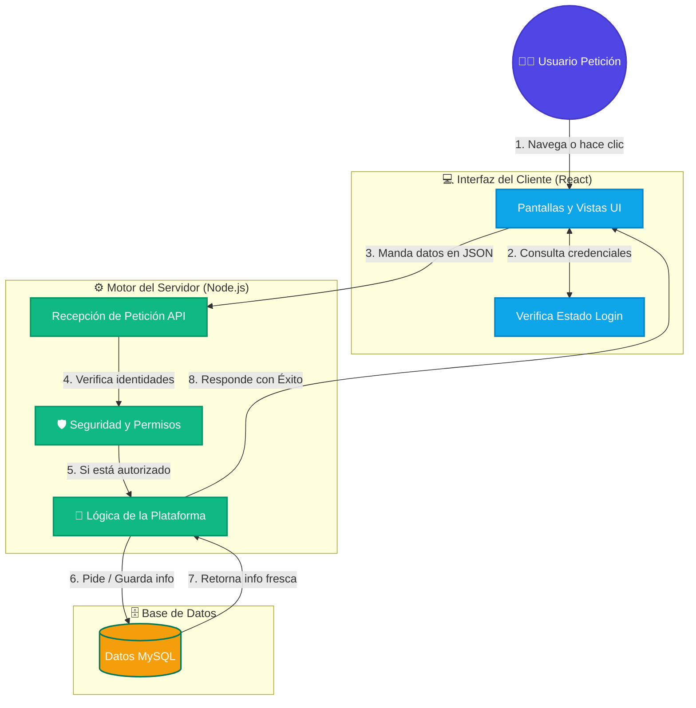

<div align="center">
  

  # 🚀 Clean Coders Blog

  *Una plataforma escalable, robusta y de alto rendimiento para desarrolladores. Comparte noticias, recursos y tutoriales en video con la comunidad.*

  [](https://reactjs.org/)
  [](https://vitejs.dev/)
  [](https://nodejs.org/)
  [](https://www.typescriptlang.org/)
  [](https://www.mysql.com/)
</div>

---

## 🎯 Funcionalidades Principales

Nuestra plataforma ha sido diseñada desde cero para garantizar la mejor experiencia de usuario y una gestión de seguridad impenetrable en el backend.

| Característica | Descripción |
| :---: | :--- |
| 🛡️ **Seguridad y Autenticación** | Flujo de autenticación seguro utilizando **JWT (JSON Web Tokens)** y **bcrypt**. Autorización precisa de rutas mediante middleware personalizado para separar administradores y usuarios. |
| 🗞️ **Motor de Noticias y Blog** | Capacidades completas CRUD para noticias de tecnología. Incluye APIs REST robustas para consultar, crear y gestionar los artículos en la base de datos. |
| 🎥 **Plataforma Educativa** | Biblioteca integrada para recursos enfocados en desarrolladores y tutoriales en vídeo. Controladores dedicados para gestionar un ecosistema de aprendizaje integral. |
| 🔒 **Arquitectura Enterprise** | Backend listo para producción empleando **Helmet** para proteger cabeceras HTTP, **express-rate-limit** para protección DDoS y **express-validator** para un saneamiento estricto. |

---

## 📂 Estructura del Proyecto

La arquitectura del código sigue las mejores prácticas de separación de responsabilidades, dividiendo el ecosistema en entornos independientes Cliente / Servidor.

```text
📦 CleanCoders_Blog/
├── 📁 client/                # 💻 Frontend React + Vite (SPA)
│   ├── 📁 public/            # 🌐 Archivos estáticos públicos
│   ├── 📁 src/               
│   │   ├── 📁 assets/        # 🎨 Recursos visuales y multimedia
│   │   ├── 📁 components/    # 🧩 Componentes UI (Nav, Footer, Forms)
│   │   ├── 📁 context/       # 🧠 Estados globales y AuthContext
│   │   ├── 📁 layout/        # 📐 Estructuras maestras de página
│   │   ├── 📁 pages/         # 📄 Vistas (Home, Login, Noticias, Perfil)
│   │   ├── 📁 routes/        # 🛣️ Configuración dinámica de React Router
│   │   └── 📁 services/      # 🔌 Integración API (Llamadas Axios/Fetch)
│   ├── 📄 package.json       # 📦 Dependencias y scripts frontend
│   └── ⚙️ vite.config.js     # 🛠️ Configuración rápida del bundler
│
├── 📁 server/                # ⚙️ Backend Node.js + Express
│   ├── 📁 controllers/       # 🧠 Lógica de negocio de la API REST
│   ├── 📁 database/          # 🗄️ Conexión principal a MySQL / Sequelize
│   ├── 📁 interfaces/        # 📏 Tipados de TypeScript para validaciones
│   ├── 📁 middleware/        # 🛡️ Seguridad local (JWT, Roles, Bloqueos)
│   ├── 📁 migrations/        # 🏗️ Scripts estructurados para Base de Datos
│   ├── 📁 models/            # 📊 Modelos ORM (Data Layer)
│   ├── 📁 routes/            # 🛤️ Definición modular de endpoints API
│   ├── 📁 __test__/          # 🧪 Pruebas unitarias e integración (Jest)
│   ├── 📄 app.ts             # 🚀 Entry-point de nuestro servidor Express
│   └── 📄 package.json       # 📦 Dependencias estables backend
│
└── 📄 README.md              # 📖 Este archivo de especificaciones
```

---

## 🏗️ Flujo de Datos y Arquitectura Aplicada

La aplicación funciona mediante un modelo de **Cliente-Servidor** donde la interfaz amigable y la API REST se comunican de forma rápida y segura. A continuación un diagrama visual simplificado del recorrido de datos de un usuario interactuando con la aplicación.



---

## 💻 Stack Tecnológico Completo

Hemos elegido un ecosistema tecnológico moderno, enfocado directamente en la velocidad de iteración, escalabilidad y una experiencia de desarrollo de primer nivel.

### Frontend (Cliente orientable a UI)
-  **React 18** (`react`, `react-dom`): Framework UI declarativo basado en la reconciliación del DOM y componentes reutilizables.
-  **Vite**: Herramienta de construcción ultra rápida. Soporta sustituto de módulos en caliente (HMR) casi instantáneo usando SWC.
-  **Tailwind CSS v3**: Motor de estilizado *utility-first* altamente optimizado gracias al paso previo de PostCSS.
-  **React Router DOM v6**: Gestión dinámica y unificada del enrutamiento sin recargas (Client-side routing).

### Backend (Servidor de aplicaciones)
-  **Node.js**: Entorno de ejecución JavaScript intensivo manejado por eventos (V8 Engine).
-  **Express**: Micro-framework web que permite construir la estructura HTTP del API Gateway fácilmente.
-  **TypeScript**: Superset de JavaScript que nos ofrece tipado fuerte local estático y previene incontables errores en runtime.
-  **Sequelize**: ORM basado en Promesas que nos abstrae de sentencias SQL puras y estandariza consultas de capa base.
-  **MySQL 2**: Controlador moderno de MySQL para interactuar directamente desde Node hacia la capa persistente de datos.
-  **Jest & Supertest**: Herramientas integrales para crear aserciones precisas en nuestras APIs asíncronas.
-  **JWT (JSON Web Tokens)**: Certificados simétricos y compactos utilizados dentro de todo el flujo Auth (Stateless Authentication).

---

## 🚀 Guía de Inicio Rápido (Quick Start)

Para desplegar este proyecto en tu entorno local, asegúrate de tener instalado previamente tu motor **Node.js (v18+)** y un entorno funcional **MySQL**. 

### 1. Clonar e Instalar las Dependencias

Abre tu terminal favorita e instala los módulos para ambos proyectos:

```bash
# Instalador para dependencias del cliente React
cd client
npm install

# Instalador consecutivo para dependencias del servidor
cd ../server
npm install
```

### 2. Configurar Variables de Entorno Seguras

Las integraciones hacia tu motor SQL y tu JWT Secret dependen de variables locales. Copia los esquemas para crear los tuyos:

```bash
# Ubicado en la ruta /server
cp .env.example .env
# IMPORTANTE: Rellena tus claves, puerto local y accesos dentro de '.env'
```

### 3. Migraciones a la Base de Datos

Comienza asegurándote que exista la base principal en PHPMyAdmin o MySQL Workbench. A continuación, corre la integración estructural de Sequelize desde el propio proyecto:

```bash
cd server
npm run migrate
```

### 4. Ejecución Integral (Modo Desarrollo Full Stack)

El proyecto completo requiere que corras ambos servidores operando mutuamente. Abre dos nuevas instancias en tu terminal:

**Terminal 1 (Backend - API REST):**
```bash
cd server
npm run dev
# Ejecutará ts-node-dev en modo Watch constante. Disponible puerto http://localhost:PORT
```

**Terminal 2 (Frontend - Interfaz SPA):**
```bash
cd client
npm run dev
# Levantará inmediatamente Vite con HMR. Disponible UI temporal proxy en http://localhost:5173
```

---

## 📷 Demostración de la Aplicación (UI / Modo Visual)

<div align="center">
  <!-- MOCKUP PLACEHOLDER -->
  <picture>
    
  </picture>
  <br/><br/>
  <p><i>Captura de simulación local: Tablero principal gestionando publicaciones dinámicas, el sistema visual de perfil y área de desarrollo iterativo.</i></p>
</div>

---

## 🧪 Contribuciones y Entorno de Testing Integrado

El directorio `/server` incluye un ecosistema de comprobación continua enfocado en Controladores. Para iniciar y auditar validaciones en un entorno aislado, lanza el motor local de pruebas:

```bash
cd server
# Compilará y descubrirá test con extensiones *.test.ts
npm test 
```

---
<div align="center">
  <strong>Ingeniería meticulosa. Código moderno. Construido para crecer.</strong> <br>
  © 2026 Clean Coders Blog
</div>
